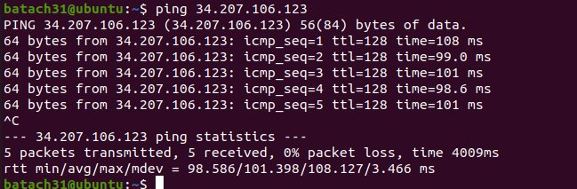

# Lab 01 - Cloud Computing

Author : Baptiste Hardrick & David Jaquet

## Create an Amazon EC2 instance

- What is the smallest and the biggest instance type (in terms of virtual CPUs and memory) that you can choose from when creating an instance?

- |          | Instance type | Virtual CPUs | Memory   |
  | -------- | ------------- | ------------ | -------- |
  | Smallest | t2.nano       | 1            | 0.5 Gio  |
  | Biggest  | x1e.32xlarge  | 128          | 3904 Gio |

  

- How long did it take for the new instance to get into the *running* state?

  - We didn't measure exactly the **pending** time, but it took between 5 and 10 minutes before the instance state became **running**.

- From the **EC2 Management Console** copy the **public DNS** name of the instance into the report.

  - The **public DNS** name is `ec2-54-224-211-186.compute-1.amazonaws.com`

- Once you have successfully logged into your EC2 instance, run the `hostname` and `uname -a` commands and paste their outputs into the report.

  - You can find below the output of the `hostname` and `uname -a` commands :

    ```bash
    $ hostname
    ip-172-31-47-190
    
    $ uname -a
    Linux ip-172-31-47-190 4.15.0-1057-aws #59-Ubuntu SMP Wed Dec 4 10:02:00 UTC 2019 x86_64 x86_64 x86_64 GNU/Linux
    ```

    

- Try to ping the instance from your local machine. What do you see? Explain. Change the configuration to make it work. Ping the instance, record 5 round-trip times.

  - Nothing happens, That is because the firewall (Security Group) only accepts the `SSH` connections.

  - To successfully ping the instance, we had to change our Security Group by clicking on `modifier les règles entrantes`. Then, we add a rule `Accept all ICMP - IPv4` from all sources.

  - Here is the result of `ping` command

    

- Determine the IP address seen by the operating system in the EC2 instance by running the `ifconfig` command. What type of address is it? Compare it to the address displayed by the ping command earlier. How do you explain that you can successfully communicate with the machine?

  

  


## Task 3: Install a web application


### Download and install Drupal


### Set up Drupal


## Task 4: Create an additional EBS volume and use snapshots


## Task 5: Performance analysis of our instance (optional)


## Task 6: Resource consumption an pricing


## Task 7: Cleanup


