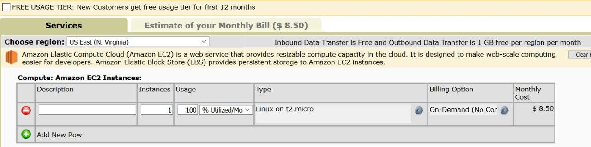

# Lab 01 - Cloud Computing

Author : Baptiste Hardrick & David Jaquet

## Create an Amazon EC2 Instance

- What is the smallest and the biggest instance type (in terms of virtual CPUs and memory) that you can choose from when creating an instance?

    |          | Instance type  | Virtual CPU(s) | Memory   |
    | -------- | -------------- | -------------- | -------- |
    | Smallest | `t2.nano`      | 1              | 0.5 Gio  |
    | Biggest  | `x1e.32xlarge` | 128            | 3904 Gio |

- How long did it take for the new instance to get into the *running* state?

  - We didn't measure exactly the **pending** time, but it took between 5 and 10 minutes before the instance state became **running**.

- From the **EC2 Management Console** copy the **public DNS** name of the instance into the report.

  - The **public DNS** name is `ec2-54-224-211-186.compute-1.amazonaws.com`

- Once you have successfully logged into your EC2 instance, run the `hostname` and `uname -a` commands and paste their outputs into the report.

  - You can find below the output of the `hostname` and `uname -a` commands :

    ```bash
    $ hostname
    ip-172-31-47-190
    
    $ uname -a
    Linux ip-172-31-47-190 4.15.0-1057-aws #59-Ubuntu SMP Wed Dec 4 10:02:00 UTC 2019 x86_64 x86_64 x86_64 GNU/Linux
    ```

- Try to ping the instance from your local machine. What do you see? Explain. Change the configuration to make it work. Ping the instance, record 5 round-trip times.

  - Nothing happens. This is because the firewall (Security Group) only accepts the `SSH` connections.

  - To successfully ping the instance, we had to change our Security Group by clicking on `edit incoming rules`. Then, we add a rule `Accept all ICMP - IPv4` from all sources.

  - Here is the result of `ping` command

    

- Determine the IP address seen by the operating system in the EC2 instance by running the `ifconfig` command. What type of address is it? Compare it to the address displayed by the ping command earlier. How do you explain that you can successfully communicate with the machine?

  

  - The pinged address was `54.224.211.186`, but the address of the virtual machine is `172.31.47.190`. The first address is the address of the DNS server where our VM is located. The `NAT` will know that we want to access to our machine at the address `172.31.47.190` with its translation table.
  
  - The IP address obtained with the `ifconfig` command is the effective IPv4 address of the virtual machine.

## Install a web application

- Add a screenshot of the page you created in Drupal to the report.

  - Below is our Drupal page :

    

- Add the Elastic IP Address you created to the report

  - The Elastic IP Address is `52.20.121.59`

- Why is it a good idea to create an Elastic IP Address for a web site (our web application)? Why is it not sufficient to hand out as URL for the web site the public DNS name of the instance? 

  - It is a good idea to create an Elastic IP Address because it works like a **static** IPv4 address. Which means, it doesn't change, unlike the DNS address of the instance which changes each time we restart it.
    It is not sufficient to hand out the public DNS name because it's not permanent.

## Create an additional EBS Volume and use Snapshots

-  What is the size of the EBS Volume? 

  - The size of our EBS Volume is `8 Gio`.

    

- Inside the Instance examine the mounted root volume with `df -h /`. What capacity does the operating system see and how much space is left? 

  - We can see in the screen below that the operating system can see a size `7.7 G`, but only `2.2 G` is used. There is still `5.6 G` of space available.

  

  - Our Instance is available in the zone `us-east-1a` :

    

-  Copy the Availability Zone of your Instance and Volume into the report. 

  - Here is the Availability Zone of our Instance and Volume. Note that we use each of our last name to differentiate each of our test volume easily.

    

- Copy the available space after formatting and mounting into the report.

  - After formatting and mounting, we still have `2.2 G` of space available

    

## Performance analysis of our instance (optional)

- Provide the URLs of the Geekbench results for the EC2 instance and your local machine. 

  - Here is the link to the Geekbench results for our [instance](http://browser.primatelabs.com/geekbench3/8849285) and our [local machine](http://browser.primatelabs.com/geekbench3/8849287).

- Provide system information about the EC2 instance.

  - Below, the system information about our EC2 instance :

    

- Provide the single-core and multi-core performance scores for overall, integer, floating-point and memory performance of the EC2 instance.

  - Here is an array with the single-core and mutli-core performance scores of the EC2 instance :

    | Core        | Integer | Floating Point | Memory | Overall |
    | ----------- | ------- | -------------- | ------ | ------- |
    | Single-core | 2672    | 2576           | 2863   | 2671    |
    | Multi-core  | 2655    | 2572           | 2878   | 2666    |

- Provide system information about your local machine.

  - Below, the system information about our local machine :

    

-  Provide the single-core and multi-core performance scores for overall, integer, floating-point and memory performance of your local machine. 

  - Here is an array with the single-core and mutli-core performance scores of our local machine :

    | Core        | Integer | Floating Point | Memory | Overall |
    | ----------- | ------- | -------------- | ------ | ------- |
    | Single-core | 4023    | 3856           | 4033   | 3958    |
    | Multi-core  | 3987    | 3921           | 4066   | 3976    |

- Compare the overall scores of the two machines.

  - Our local machine is a virtual machine with **Ubuntu 19.10** running on it. As we can see in the performances tables, the of the single-core and multi-core overall score of the virtual machine is **~1.5 times better** than the AWS Instance.

## Resource consumption an pricing

- How much does your instance (including disk) cost per hour? What was its cost for this lab?
  
  - The cost of an `t2.micro` is **0.0116 per hour**. We estimate that our instance had a running time of **3 hours per week**. So our instance operated for **6 hours in total** and we spent **$ 0.0696** for it.
  
- Change the parameters to an instance that runs continuously during the whole month. Note the total cost.

  - If the instance runs continuously during the whole month, the total cost will be **$ 8.50**.

    

    

- If you buy a 1 TB SSD disk at Digitec it currently costs CHF 289. How much does a 1 TB ESB Volume cost for a month?
  
  - In this case, Amazon Web Service will be cheaper. It costs **$ 110.90** for a month.
  
    
  
    

